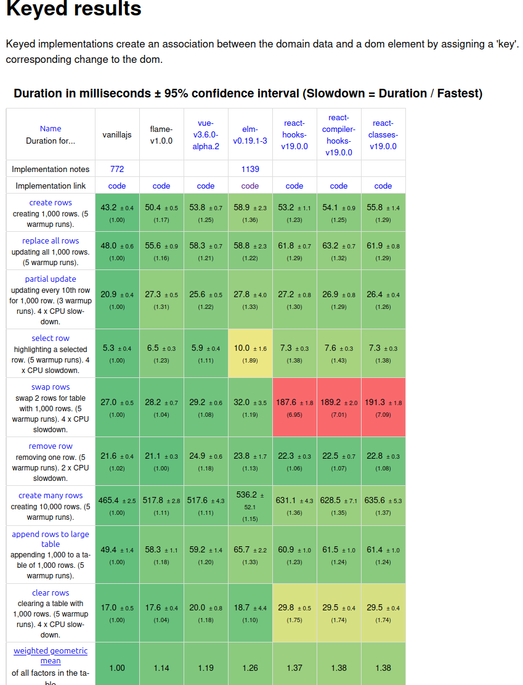
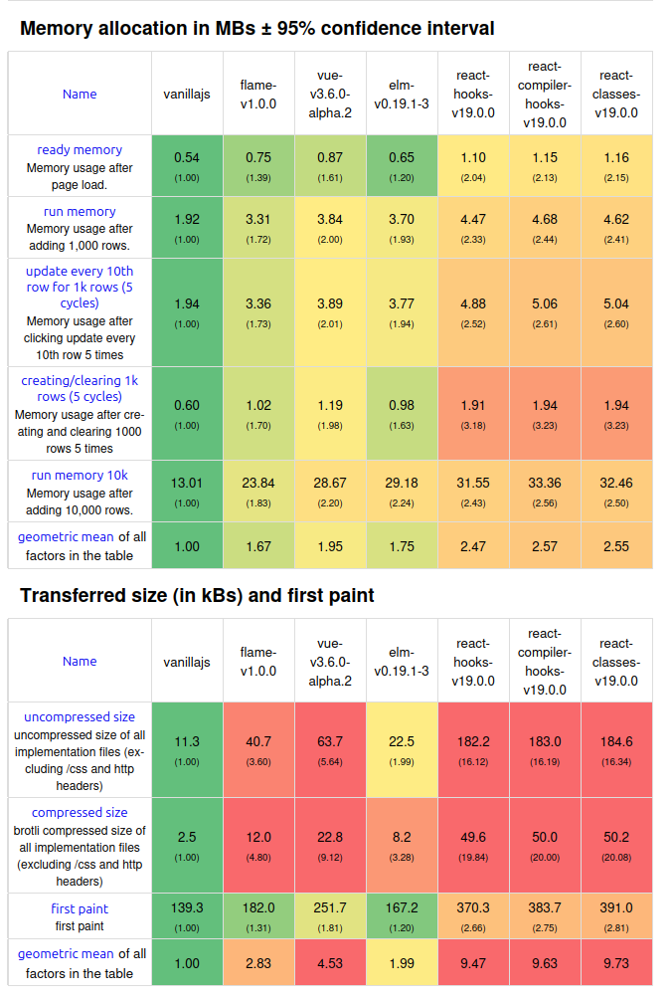
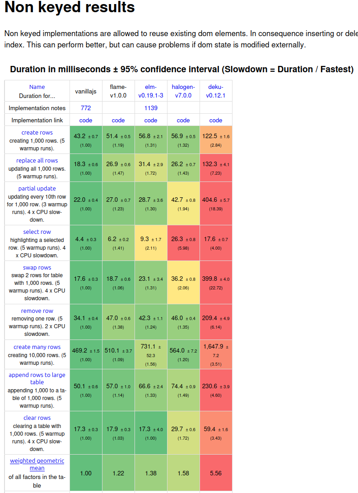
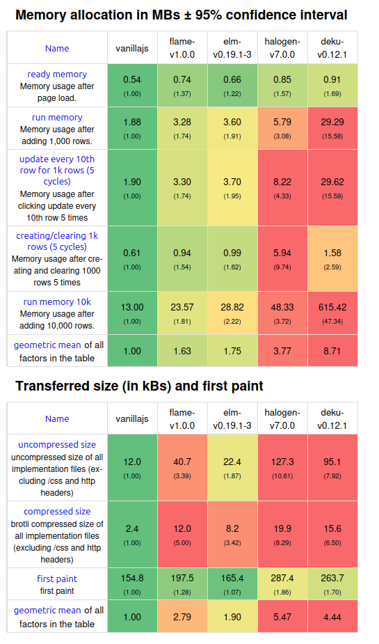

## Benchmarks

Flame performs comparatively to similar JavaScript or PureScript libraries in usual metrics like bundle size, initialization speed, memory usage, etc. For what it is worth, here is how it stacks against a few popular frameworks (on an old Linux Core i5 with 16GB of ram):

See also the official results at the [js web frameworks benchmark](https://krausest.github.io/js-framework-benchmark/index.html).

These figures should be taken with a grain of salt, however. For most applications, virtually any front-end framework is "fast" enough. Techniques like server-side rendering, caching, lazy rendering, etc go a long before we actually have to think about DOM manipulation performance.